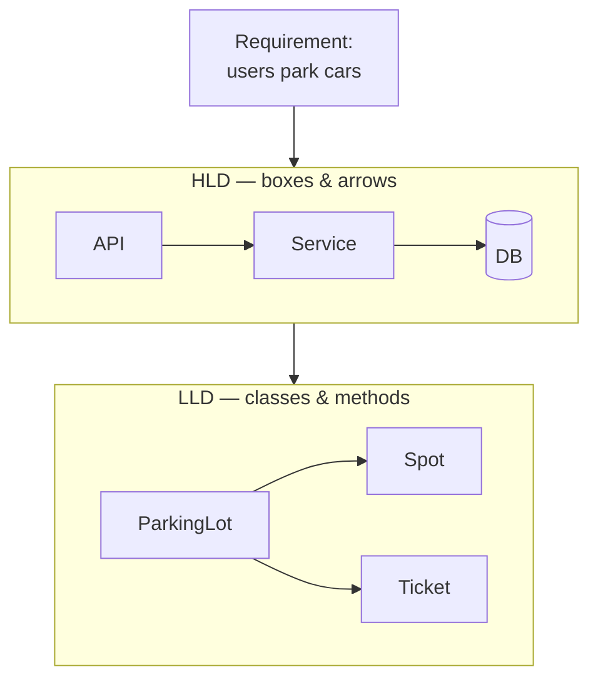

<div class="bp-eyebrow mb-4" v-motion :initial="{ x: -40, opacity: 0 }" :enter="{ x: 0, opacity: 1, transition: { delay: 80 } }">LOW-LEVEL DESIGN · DECK 1</div>

<div v-motion :initial="{ y: 36, opacity: 0 }" :enter="{ y: 0, opacity: 1, transition: { delay: 180 } }">

# Foundations

</div>

<div class="text-2xl bp-dim mt-2 mb-8 bp-mono" v-motion :initial="{ y: 24, opacity: 0 }" :enter="{ y: 0, opacity: 1, transition: { delay: 320 } }">From objects to relationships — the bedrock of clean design.</div>

<div class="flex gap-3" v-motion :initial="{ opacity: 0 }" :enter="{ opacity: 1, transition: { delay: 480 } }">
  <span class="bp-chip">01 · LLD Intro</span>
  <span class="bp-chip">02 · OOP Fundamentals</span>
  <span class="bp-chip">03 · Class Relationships</span>
</div>

<div class="abs-br m-6 bp-dim text-sm">
  press <span class="bp-key">space</span> to advance · <span class="bp-key">o</span> for overview
</div>

<!--
Welcome. This deck builds the foundation: what LLD is, the OOP toolkit, and how
objects connect. Everything here is hands-on — diagrams react, demos are clickable.
-->

---
layout: default
---

## The path

<div class="grid grid-cols-3 gap-4 mt-6">
<div class="bp-card bp-card--cyan" v-click="1">
  <div class="text-3xl bp-mono bp-glow-text">01</div>
  <div class="text-xl mt-1">LLD Introduction</div>
  <div class="bp-dim text-sm mt-2">What LLD is · LLD vs HLD · interview types</div>
  <div class="bp-track mt-3"><span class="bp-dot bp-dot--on" v-for="n in 3" /></div>
</div>
<div class="bp-card" v-click="2">
  <div class="text-3xl bp-mono">02</div>
  <div class="text-xl mt-1">OOP Fundamentals</div>
  <div class="bp-dim text-sm mt-2">classes · the 4 pillars · enums & interfaces</div>
</div>
<div class="bp-card bp-card--violet" v-click="3">
  <div class="text-3xl bp-mono">03</div>
  <div class="text-xl mt-1">Class Relationships</div>
  <div class="bp-dim text-sm mt-2">association → composition → realization</div>
</div>
</div>

<div v-click="4" class="mt-12 text-center bp-dim bp-mono text-sm">
  3 modules · 27 lessons — let's go &rarr;
</div>

---
layout: default
class: section-slide
---

<div class="ghost-num">01</div>
<div class="section-body">
  <div class="accent-bar"></div>
  <div class="bp-eyebrow mb-3">MODULE 01</div>
  <h1>LLD Introduction</h1>
  <div class="flex gap-3 mt-6">
    <span class="bp-chip">4 lessons</span>
  </div>
</div>

---

## What is Low-Level Design?

<div class="grid grid-cols-2 gap-8 items-center">
<div>

> **LLD** turns *what* the system should do into *how* the code is actually structured — the classes, their data, their methods, and how they collaborate.

<v-clicks>

- **Class-level**, not server-level
- Defines **objects, fields, methods**
- Specifies **relationships & contracts**
- Optimizes for **change, testing, reuse**

</v-clicks>

</div>
<div>



</div>
</div>

<!-- HLD draws the boxes; LLD designs what lives inside one box. -->

---
layout: two-cols-header
---

## LLD vs HLD

::left::

<div class="bp-card mr-4 h-full">
<div class="bp-chip mb-3">High-Level Design</div>

<v-clicks>

- Architecture & **services**
- Scaling, sharding, queues
- *Where* things run
- Audience: **architects**

</v-clicks>
</div>

::right::

<div class="bp-card bp-card--cyan h-full">
<div class="bp-chip mb-3">Low-Level Design</div>

<v-clicks>

- **Classes** & interfaces
- Patterns, SOLID, contracts
- *How* a component works
- Audience: **engineers**

</v-clicks>
</div>

::bottom::

<div v-click class="text-center bp-dim mt-4 bp-mono text-sm">
zoom out &rarr; HLD · &nbsp; zoom in &rarr; LLD &nbsp; — &nbsp; this deck lives at the zoom-in.
</div>

---

## Types of LLD interviews

<div class="bp-dim bp-mono text-sm mb-5">They come in a few flavors — each probes a different muscle.</div>

<div class="grid grid-cols-1 gap-2">
  <div class="bp-card itype" v-click><span class="dur">45–60m</span><div><b>OOD / Whiteboard</b> <span class="bp-dim">— class diagrams, relationships, communicating a design</span></div></div>
  <div class="bp-card itype" v-click><span class="dur">60–90m</span><div><b>Machine Coding</b> <span class="bp-dim">— working code in an IDE, under the clock</span></div></div>
  <div class="bp-card itype" v-click><span class="dur">60–90m</span><div><b>Concurrency</b> <span class="bp-dim">— thread-safety, locks, race conditions</span></div></div>
  <div class="bp-card itype" v-click><span class="dur">30–45m</span><div><b>API &amp; Schema Design</b> <span class="bp-dim">— interface contracts, data modeling</span></div></div>
</div>

---
layout: default
class: section-slide
---

<div class="ghost-num">02</div>
<div class="section-body">
  <div class="accent-bar"></div>
  <div class="bp-eyebrow mb-3">MODULE 02</div>
  <h1>OOP Fundamentals</h1>
  <div class="flex gap-3 mt-6">
    <span class="bp-chip">classes & objects</span>
    <span class="bp-chip">the 4 pillars</span>
  </div>
</div>

---

## Classes & Objects

<div class="grid grid-cols-2 gap-6 items-center">
<div>

A **class** is a blueprint. An **object** is one thing built from it.

```python {all|1-4|6-8|10-12|all}{lines:true}
class Car:
    def __init__(self, color):
        self.color = color   # state
        self.speed = 0

    def accelerate(self, dv):
        self.speed += dv     # behavior

# objects = instances of the blueprint
a = Car("cyan")
b = Car("violet")
```

</div>
<div>

<ObjectSpawn />

</div>
</div>

---

## Enums

<div class="bp-dim bp-mono text-sm mb-3">A fixed, type-safe set of named values — no more magic strings.</div>

<div class="grid grid-cols-2 gap-6 items-center">
<div>

```python
from enum import Enum

class OrderStatus(Enum):
    PLACED    = "PLACED"
    CONFIRMED = "CONFIRMED"
    SHIPPED   = "SHIPPED"
    DELIVERED = "DELIVERED"

status = OrderStatus.SHIPPED
if status is OrderStatus.SHIPPED:
    notify("on the way!")
```

</div>
<div>

<EnumCycle />

</div>
</div>

---

## Interfaces & contracts

<div class="bp-dim bp-mono text-sm mb-3">Declare <i>what</i> must be done; let each class decide <i>how</i>.</div>

<div class="grid grid-cols-2 gap-6 items-center">
<div>

```python
from abc import ABC, abstractmethod

class PaymentGateway(ABC):
    @abstractmethod
    def pay(self, amount): ...

class Stripe(PaymentGateway):
    def pay(self, amount):
        charge_stripe(amount)

class Checkout:
    def __init__(self, gateway: PaymentGateway):
        self.gateway = gateway     # swap any gateway
    def process(self, amt):
        self.gateway.pay(amt)
```

</div>
<div>

<InterfaceSwap />

</div>
</div>

---

## The four pillars

<div class="grid grid-cols-4 gap-3 mt-8">
<div class="bp-card" v-click><div class="pillar-glyph">&#9707;</div><div class="text-lg mt-2">Encapsulation</div><div class="bp-dim text-xs mt-1">hide internals</div></div>
<div class="bp-card" v-click><div class="pillar-glyph">&#9681;</div><div class="text-lg mt-2">Abstraction</div><div class="bp-dim text-xs mt-1">expose intent</div></div>
<div class="bp-card" v-click><div class="pillar-glyph">&#9663;</div><div class="text-lg mt-2">Inheritance</div><div class="bp-dim text-xs mt-1">reuse via is-a</div></div>
<div class="bp-card" v-click><div class="pillar-glyph">&#8644;</div><div class="text-lg mt-2">Polymorphism</div><div class="bp-dim text-xs mt-1">many forms</div></div>
</div>

<div v-click class="mt-8 text-center bp-dim bp-mono text-sm">next: each pillar, hands-on</div>

<style>
.pillar-glyph { font-size: 2.4rem; line-height: 1; color: var(--bp-cyan); text-shadow: var(--bp-glow); }
</style>

---

## Encapsulation — *try it*

<div class="bp-dim bp-mono text-sm mb-3">Toggle the lock. Call the public methods. Then try to reach a private field directly.</div>

<EncapsulationDemo />

<!--
Click deposit/withdraw — public API always works. Click account._balance:
locked -> AttributeError; unlocked -> it leaks. That's the whole point of encapsulation.
-->

---

## Abstraction — *hide the how*

<div class="bp-dim bp-mono text-sm mb-3">Press a method, watch the hidden steps fire. <b style="color:#fff">Encapsulation hides data; abstraction hides complexity.</b></div>

<AbstractionDemo />

---

## Inheritance — *is-a*, built up

<div class="grid grid-cols-2 gap-8 items-center">
<div>

<svg viewBox="0 0 440 330" class="grow-svg">
  <defs>
    <marker id="inh" markerWidth="16" markerHeight="16" refX="13" refY="6" orient="auto">
      <path d="M1,1 L14,6 L1,11 Z" fill="#0b1324" stroke="#22d3ee" stroke-width="1.3" />
    </marker>
  </defs>

  <!-- base class: always present -->
  <g>
    <rect x="146" y="16" width="150" height="84" rx="9" class="box base" />
    <text x="221" y="42" class="t-title">Vehicle</text>
    <line x1="146" y1="54" x2="296" y2="54" class="divider" />
    <text x="160" y="74" class="t-field">+ plate</text>
    <text x="160" y="92" class="t-field">+ start()</text>
  </g>

  <!-- Car: grows in on click 1 -->
  <g v-click class="grow">
    <path d="M104,236 L196,100" class="conn" marker-end="url(#inh)" />
    <rect x="26" y="236" width="156" height="74" rx="9" class="box nodebox" />
    <text x="104" y="262" class="t-title">Car</text>
    <line x1="26" y1="274" x2="182" y2="274" class="divider nodebox" />
    <text x="40" y="296" class="t-field nodebox">+ doors</text>
  </g>

  <!-- Truck: grows in on click 2 -->
  <g v-click class="grow">
    <path d="M336,236 L246,100" class="conn" marker-end="url(#inh)" />
    <rect x="258" y="236" width="156" height="74" rx="9" class="box nodebox" />
    <text x="336" y="262" class="t-title">Truck</text>
    <line x1="258" y1="274" x2="414" y2="274" class="divider nodebox" />
    <text x="272" y="296" class="t-field nodebox">+ payload</text>
  </g>
</svg>

</div>
<div>

<v-clicks>

- `Car` **is-a** `Vehicle` — inherits `plate`, `start()`
- Override only what differs
- Share the contract, specialize the behavior
- <span class="bp-warn bp-mono">note:</span> favor **composition** when it's really *has-a*

</v-clicks>

</div>
</div>

<style>
.grow-svg { width: 100%; max-height: 300px; font-family: "Fira Code", monospace; }
.grow-svg .box { fill: rgba(34,211,238,.06); stroke: var(--bp-cyan); stroke-width: 1.4; }
.grow-svg .base { filter: drop-shadow(0 0 12px rgba(34,211,238,.25)); }
.grow-svg .t-title { fill: #fff; font-size: 15px; font-weight: 600; text-anchor: middle; }
.grow-svg .t-field { fill: var(--bp-dim); font-size: 12px; }
.grow-svg .divider { stroke: rgba(56,189,248,.3); stroke-width: 1; }
.grow-svg .conn { stroke: var(--bp-blue); stroke-width: 1.8; fill: none; }
/* draw-in growth: connector draws, then the node pops */
.grow .conn { stroke-dasharray: 320; stroke-dashoffset: 320; }
.grow:not(.slidev-vclick-hidden) .conn { animation: bp-draw .55s ease forwards; }
.grow .nodebox { opacity: 0; }
.grow:not(.slidev-vclick-hidden) .nodebox { animation: bp-pop .45s ease .35s forwards; }
@keyframes bp-draw { to { stroke-dashoffset: 0; } }
@keyframes bp-pop  { from { opacity: 0; transform: translateY(10px); } to { opacity: 1; transform: translateY(0); } }
</style>

---

## Polymorphism — one call, many forms

<div class="bp-dim bp-mono text-sm mb-4">Pick a shape, then invoke <code>shape.area()</code>. Same call site — the runtime dispatches to the right implementation.</div>

<PolyDispatch />

---
layout: default
class: section-slide
---

<div class="ghost-num">03</div>
<div class="section-body">
  <div class="accent-bar"></div>
  <div class="bp-eyebrow mb-3">MODULE 03</div>
  <h1>Class Relationships</h1>
  <div class="flex gap-3 mt-6">
    <span class="bp-chip">how objects connect</span>
  </div>
</div>

---

## Association — *uses-a*

<div class="bp-dim bp-mono text-sm mb-3">Two independent objects that reference each other. Neither owns the other.</div>

<div class="grid grid-cols-2 gap-6 items-center">
<div>

```python
class Course:
    def __init__(self, title):
        self.title = title
        self.students = []

    def enroll(self, student):
        self.students.append(student)
        student.course = self   # both sides linked

class Student:
    def __init__(self, name):
        self.name = name
        self.course = None
```

</div>
<div>

<AssociationLink />

</div>
</div>

---

## Aggregation vs Composition

<div class="bp-dim bp-mono text-sm mb-3">Both are "has-a" — the difference is <b style="color:#fff">ownership</b>. Switch mode, then destroy the whole.</div>

<LifecycleDemo />

<!--
Composition = strong ownership: destroy the House, the Rooms die too (filled diamond).
Aggregation = shared: disband the Team, the Players live on (hollow diamond).
-->

---

## Dependency — *uses, briefly*

<div class="bp-dim bp-mono text-sm mb-3">The weakest link: passed in, used, gone. No stored reference.</div>

<div class="grid grid-cols-2 gap-6 items-center">
<div>

```python
class Document:
    def __init__(self, content):
        self.content = content

class Printer:
    def print(self, doc: Document):   # only a parameter
        send_to_tray(doc.content)

Printer().print(Document("Hello"))
```

</div>
<div>

<DependencyCall />

</div>
</div>

---

## Realization — *implements*

<div class="bp-dim bp-mono text-sm mb-3">Unrelated classes fulfilling one contract — the dashed-triangle of "implements".</div>

<div class="grid grid-cols-2 gap-6 items-center">
<div>

```python
from abc import ABC, abstractmethod

class Flyable(ABC):
    @abstractmethod
    def fly(self): ...

class Bird(Flyable):
    def fly(self): return "flaps wings"

class Airplane(Flyable):
    def fly(self): return "engines roar"

for f in (Bird(), Airplane()):
    print(f.fly())
```

</div>
<div>

<RealizationContract />

</div>
</div>

---

## The UML cheat-sheet

<div class="bp-dim bp-mono text-sm mb-6">Five arrows you will use constantly — memorise the diamonds.</div>

<table class="cheat">
<thead><tr><th>Notation</th><th>Relationship</th><th>Reads as</th><th>Example</th><th>Lifetime</th></tr></thead>
<tbody>
<tr v-click><td class="g">A &mdash;&mdash;&gt; B</td><td>Association</td><td>uses / knows</td><td><code>Order &rarr; Customer</code></td><td>independent</td></tr>
<tr v-click><td class="g">A&nbsp; o&mdash;&mdash; B</td><td>Aggregation</td><td>has-a (shared)</td><td><code>Team o&mdash; Player</code></td><td class="bp-good">parts outlive</td></tr>
<tr v-click><td class="g">A&nbsp; *&mdash;&mdash; B</td><td>Composition</td><td>owns (strong)</td><td><code>House *&mdash; Room</code></td><td class="bp-bad">die together</td></tr>
<tr v-click><td class="g">A&nbsp; ..&gt; B</td><td>Dependency</td><td>depends-on</td><td><code>Car ..&gt; Engine</code></td><td>transient</td></tr>
<tr v-click><td class="g">A &lt;|..&nbsp; B</td><td>Realization</td><td>implements</td><td><code>Bird &lt;|.. Flyable</code></td><td>contract</td></tr>
</tbody>
</table>

<style>
.cheat { width: 100%; border-collapse: collapse; font-size: 1.05rem; margin-top: .5rem; }
.cheat th { text-align: left; color: var(--bp-dim); font-family: "Fira Code", monospace; font-size: .68rem; text-transform: uppercase; letter-spacing: .14em; padding: .5rem .8rem; border-bottom: 1px solid var(--bp-line); }
.cheat td { padding: .55rem .8rem; border-bottom: 1px solid rgba(56,189,248,.08); }
.cheat td.g { font-family: "Fira Code", monospace; color: var(--bp-cyan); white-space: nowrap; }
.cheat tr:hover td { background: rgba(34,211,238,.05); }
</style>

---
layout: default
---

<div class="bp-eyebrow mb-2">DECK 1 · RECAP</div>

## You now know

<div class="grid grid-cols-3 gap-4 mt-6">
  <div class="bp-card recap-card" v-click>
    <div class="recap-head"><span class="bp-mono bp-glow-text">01</span> LLD Intro</div>
    <ul class="recap-list">
      <li>class-level design</li>
      <li>LLD vs HLD</li>
      <li>interview types</li>
    </ul>
  </div>
  <div class="bp-card recap-card" v-click>
    <div class="recap-head"><span class="bp-mono bp-glow-text">02</span> OOP</div>
    <ul class="recap-list">
      <li>class · object · enum · interface</li>
      <li>encapsulation · abstraction</li>
      <li>inheritance · polymorphism</li>
    </ul>
  </div>
  <div class="bp-card recap-card" v-click>
    <div class="recap-head"><span class="bp-mono bp-glow-text">03</span> Relationships</div>
    <ul class="recap-list">
      <li>association · dependency</li>
      <li>aggregation · composition</li>
      <li>realization</li>
    </ul>
  </div>
</div>

<div v-click class="mt-10 text-center bp-mono bp-dim">Next &rarr; <span style="color:var(--bp-cyan)">Deck 2 · Principles &amp; UML</span></div>

<style>
.recap-card .recap-head { font-size: 1.25rem; color: #fff; margin-bottom: .8rem; }
.recap-card .recap-head .bp-mono { color: var(--bp-cyan); margin-right: .4rem; }
.recap-list { list-style: none; padding: 0; margin: 0; }
.recap-list li { position: relative; padding-left: 1.5rem; margin: .5rem 0; color: var(--bp-dim); font-size: .9rem; }
.recap-list li::before {
  content: ''; position: absolute; left: .2rem; top: .3em;
  width: 6px; height: 11px; border: solid var(--bp-good); border-width: 0 2px 2px 0;
  transform: rotate(45deg);
}
</style>

---
layout: end
---

<div class="text-center">
  <div class="bp-eyebrow mb-3">END OF DECK 1</div>
  <h1>Questions?</h1>
  <div class="bp-dim bp-mono mt-3">Foundations &rarr; Principles &rarr; Patterns &rarr; Interviews</div>
</div>
