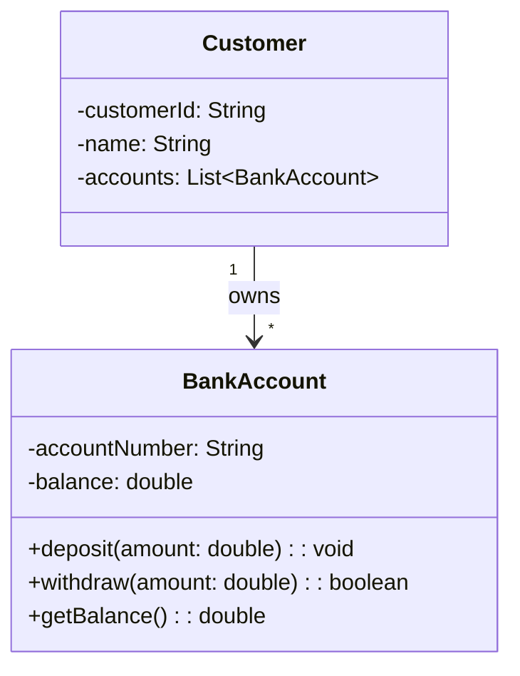
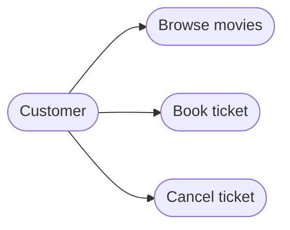

LOW-LEVEL DESIGN · DECK 2

# Principles &amp; UML

The rules that keep designs clean — and how to draw them.

  01 · Design Principles
  02 · SOLID
  03 · UML

  press space to advance · o for overview

---
layout: default
---

## The path

  
01

  
Design Principles

  
DRY · KISS · YAGNI · Law of Demeter · …

  
02

  
SOLID

  
the five object-design principles

  
03

  
UML

  
class · use-case · sequence · activity · state

  3 modules · principles you'll cite in every review &rarr;

---
layout: default
class: section-slide
---

01

  

  
MODULE 01

  <h1>Design Principles</h1>
  
DRY · KISS · YAGNILaw of Demeter

---

## DRY Principle

Every piece of knowledge should exist in exactly one place in your system.

<DryExtract />

---

## Keep It Simple, Stupid

Simpler code is more readable, maintainable, and has fewer bugs than unnecessarily complex solutions.

<KissToggle />

---

## YAGNI

Don't build features or add complexity until you actually need them.

<YagniPrune />

---

## Law of Demeter

Only talk to your immediate friends; never reach through objects to get what you want.

<DemeterChain />

---

## Separation of Concerns

Split a system into distinct parts, each responsible for exactly one concern.

<LayerFlow />

---

## Coupling & Cohesion

Aim for low coupling between modules and high cohesion within each module.

<CouplingToggle />

---

## Composing Objects

Favor composition (has-a) over inheritance (is-a) — assemble behavior from small parts.

<ComposeSwap />

---
layout: default
class: section-slide
---

02

  

  
MODULE 02

  <h1>SOLID Principles</h1>
  
S · O · L · I · D

---

## Single Responsibility Principle

A class should have one reason to change and do one thing well.

<SrpSplit />

---

## Open-Closed Principle

Software should be open for extension but closed for modification through abstraction.

<OcpPlugin />

---

## Liskov Substitution Principle

Subtypes must be safely substitutable for base types without breaking behavior.

<LspSwap />

---

## Interface Segregation

No client should be forced to depend on methods it does not use — split fat interfaces.

<IspToggle />

---

## Dependency Inversion Principle

Depend on abstractions, not implementations

<DipInvert />

---
layout: default
class: section-slide
---

03

  

  
MODULE 03

  <h1>UML Diagrams</h1>
  
structure & behavior

---

## Class Diagram: Structure & Relationships

Static view of classes, attributes, methods, and relationships in object-oriented design.

<ul class="kpts bp-dim text-sm"><li>Three compartments: name, attributes, methods</li><li>Visibility markers: + public, - private, # protected</li><li>Six relationship types from dependency to realization</li><li>Association and composition model "has-a" connections</li></ul>

---

## Use Case Diagram

Shows actors and their system goals; maps requirements before design begins

<ul class="kpts bp-dim text-sm"><li>Actor initiates or supports interaction from outside</li><li>Use case is complete goal ending with meaningful result</li><li>System boundary encloses functionality; actors outside</li><li>Associate actors to use cases with solid lines</li></ul>

---

## Sequence Diagrams

Visualizes message interactions between objects in temporal order to trace system behavior.

<SequencePlay />

---

## Activity Diagrams: Mapping Workflows

Shows the sequence of activities, decisions, and parallel paths in a workflow process.

<ActivityRun />

---

## State Machine Diagrams

Shows how objects change states in response to events; models object lifecycles and state-driven behavior.

<StateMachine />

---
layout: default
---

DECK 2 · RECAP

## You now know

  

    
01 Principles

    <ul class="recap-list">
      <li>DRY · KISS · YAGNI</li>
      <li>Demeter · separation</li>
      <li>coupling, cohesion, composition</li>
    </ul>
  

  

    
02 SOLID

    <ul class="recap-list">
      <li>SRP · OCP · LSP</li>
      <li>ISP · DIP</li>
      <li>the design backbone</li>
    </ul>
  

  

    
03 UML

    <ul class="recap-list">
      <li>class · use-case</li>
      <li>sequence · activity</li>
      <li>state machine</li>
    </ul>
  

Next &rarr; Deck 3 · Design Patterns

---
layout: end
---

  
END OF DECK 2

  <h1>Questions?</h1>
  
Foundations &rarr; Principles &rarr; Patterns &rarr; Interviews

